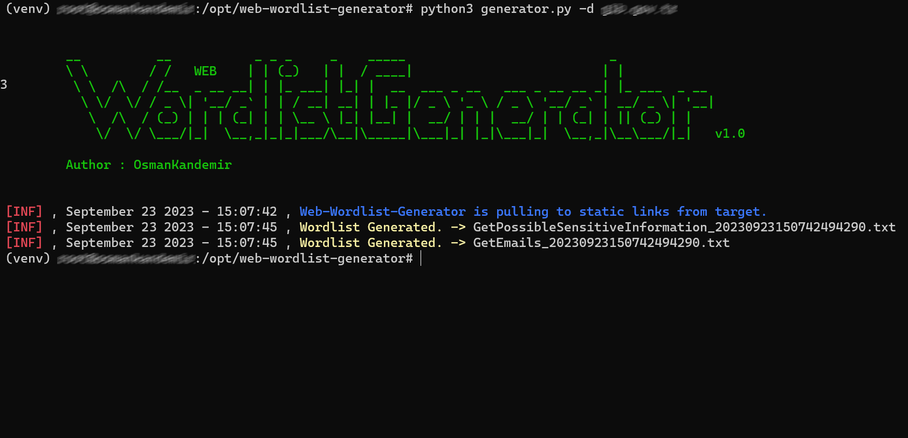

[](https://www.github.com/OsmanKandemir/web-wordlist-generator)
[](https://github.com/OsmanKandemir/web-wordlist-generator)
[](https://github.com/OsmanKandemir/web-wordlist-generator/blob/main/LICENSE)
[](https://www.python.org)
[](https://www.docker.com)


# WEB-Wordlist-Generator

#### NOTE : You should definitely use it for legal activities. Please See; [USAGE_POLICY.md](USAGE_POLICY.md) [LICENSE](LICENSE)

## Description

WEB-Wordlist-Generator creates related wordlists to take preliminary precautions against cyber attacks after scanning your web applications.

## ScreenShot




## Done
- [x] Scan Static Files.
- [ ] Scan Metadata Of Public Documents (pdf,doc,xls,ppt,docx,pptx,xlsx etc.) 
- [ ] Create a New Associated Wordlist with the Wordlist Given as a Parameter.

## Installation

### From Git

```
git clone https://github.com/OsmanKandemir/web-wordlist-generator.git
cd web-wordlist-generator && pip3 install -r requirements.txt
python3 generator.py -d target-web.com
```


### From Dockerfile

You can run this application on a container after build a Dockerfile.

```
docker build -t webwordlistgenerator .
docker run webwordlistgenerator -d target-web.com -o
```

### From DockerHub

You can run this application on a container after pulling from DockerHub.

```
docker pull osmankandemir/webwordlistgenerator:v1.0
docker run osmankandemir/webwordlistgenerator:v1.0 -d target-web.com -o
```


## Usage

```
-d DOMAINS [DOMAINS], --domains DOMAINS [DOMAINS] Input Multi or Single Targets. --domains target-web1.com target-web2.com
-p PROXY, --proxy PROXY Use HTTP proxy. --proxy 0.0.0.0:8080
-a AGENT, --agent AGENT Use agent. --agent 'Mozilla/5.0 (Windows NT 10.0; Win64; x64)'
-o PRINT, --print PRINT Use Print outputs on terminal screen.
 
```


## Development and Contribution

#### See; [CONTRIBUTING.md](CONTRIBUTING.md)


## License

Copyright (c) 2023 Osman Kandemir \
Licensed under the GPL-3.0 License.

## Donations

If you like WEB Wordlist Generator and would like to show support, you can use **Buy A Coffee** or **Github Sponsors** feature for the developer using the button below.

Or

Sponsor me : https://github.com/sponsors/OsmanKandemir 😊

<a href="https://www.buymeacoffee.com/OsmanKandemir" target="_blank"></a>

Your support will be much appreciated😊
